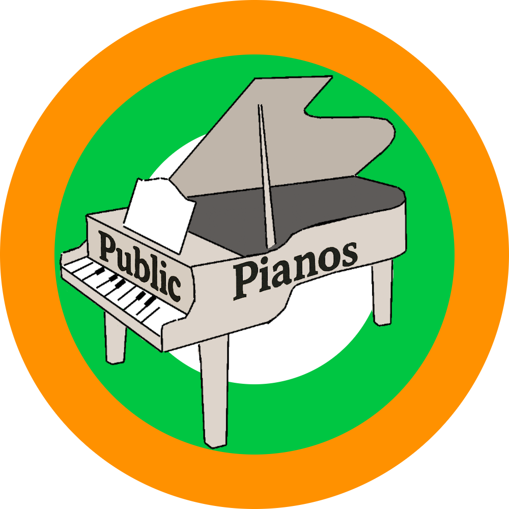

  

# 🎹 PublicPianos.org

Este proyecto es una página web que muestra pianos públicos de todo el mundo. Es un proyecto sin ánimo de lucro y que requiere la participación activa de todo el mundo para estar actualizado.

---

## 🗺️ Vista general

- Muestra marcadores de pianos en un mapa.
- Los íconos cambian según el estado del piano.
- Al hacer clic en un marcador, se muestra una imagen, descripción y un enlace a Google Maps.

---

## ✏️ Sobre como participar

Puedes añadir un piano mandándolo desde el formulario de la página. Si no funciona el formulario por lo que sea puedes usar también el discord o hacer una pull request al archivo json donde se guardan todos los pianos. También estamos abiertos a contribuciones de código para mejorar la página.

